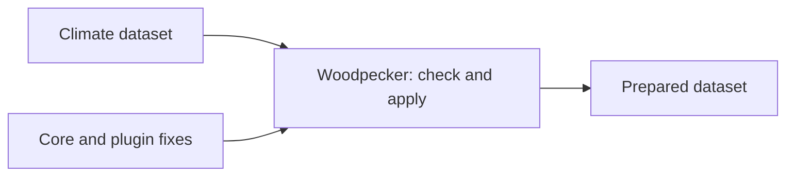
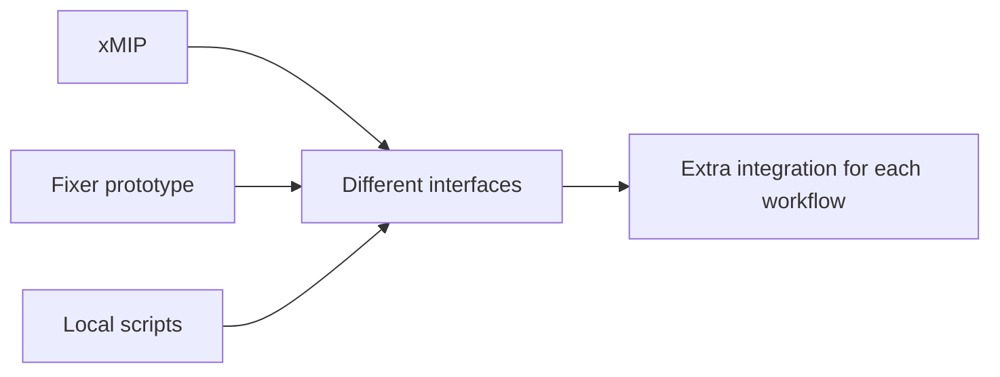
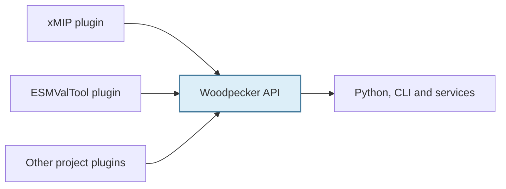
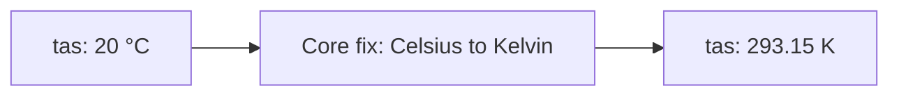
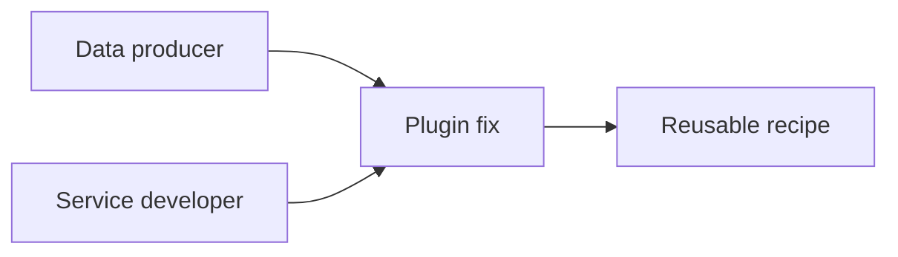
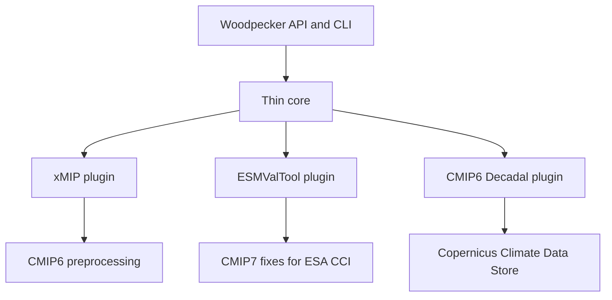
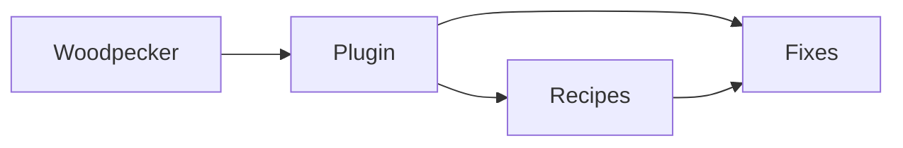
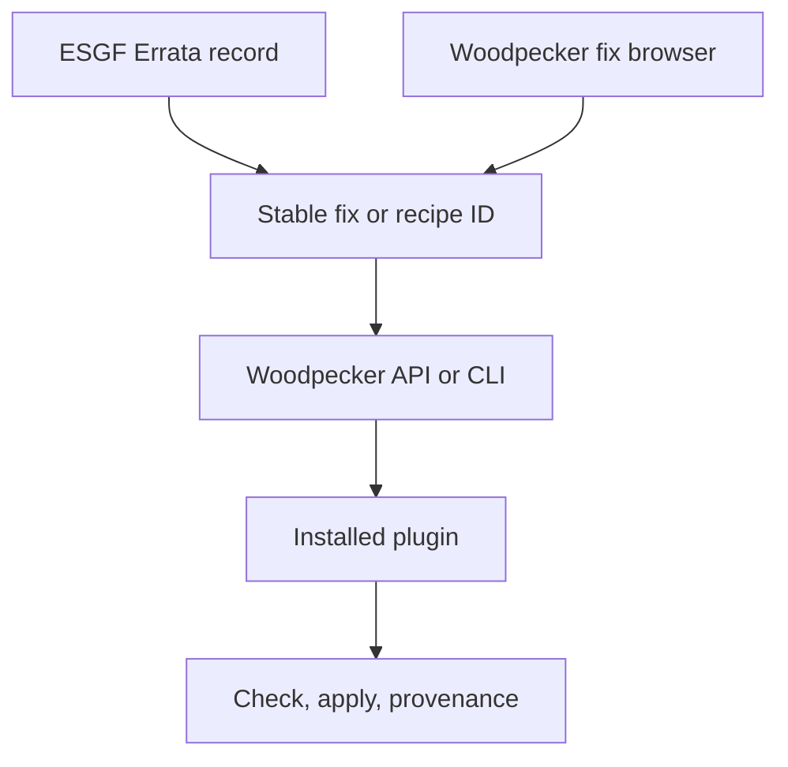
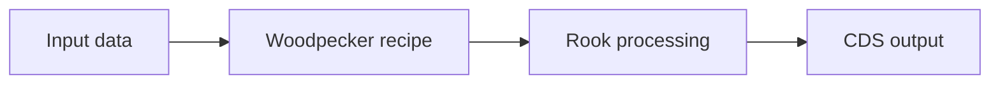

# Woodpecker

## A common interface for climate-data fixes

**Presenter:** Ag Stephens (CEDA/STFC)

**Contributors:**  
Carsten Ehbrecht (DKRZ)  
Bouwe Andela (ESMValTool)  
Rhys Evans (STFC)

<https://github.com/roocs/woodpecker>

Milano, 2026

[](https://commons.wikimedia.org/wiki/File:PileatedWoodpeckerFeedingonTree,_crop.jpg)

*Photo: Joshlaymon, [Wikimedia Commons](https://commons.wikimedia.org/wiki/File:PileatedWoodpeckerFeedingonTree,_crop.jpg), [CC BY-SA 3.0](https://creativecommons.org/licenses/by-sa/3.0/).*

---

# 1. What is Woodpecker?

A **lightweight Python interface** to discover, combine, and apply climate-data fixes.



- Repair issues such as **temperature units, coordinate names, and metadata**.
- Use the same fixes through a **Python API or command line**.
- Already used by **Rook** for **Copernicus CDS fixes**.

---

# 2. The problem: fragmented fixes

- [**xMIP**](https://github.com/jbusecke/xMIP): CMIP preprocessing for Pangeo workflows.
- [**ESMValTool fixer prototype**](https://github.com/ESMValGroup/fixer-prototype): configurable fixes with CMIP7 and ESA-CCI examples.
- **Project and service scripts**: repairs maintained in local workflows.



Useful fixes exist, but **finding, referencing, and reusing them across projects is hard**.

> It would be really great if we could all work together on the fixes package to avoid developing fragmented fixes solutions again.
>
> — Bouwe Andela, ESMValTool

---

# 3. What does Woodpecker provide?

**A thin common API for independent plugins.**



- **Common structure:** plugins implement fixes as subclasses of `FixFunction`.
- **Maintainable fixes:** express repair logic as focused, testable fix implementations.
- **Independent scope:** each plugin decides what to fix and how; Woodpecker discovers and runs it through the shared API.

**Projects own their fixes; Woodpecker provides the common interface.**

---

# 4. A core fix: Celsius to Kelvin



**Implementation sketch** — Celsius input already checked; registration and metadata omitted.

```python
class NormalizeTasUnitsToKelvin(FixFunction):
    def apply(self, dataset, dry_run=True):
        if not dry_run:
            tas = dataset["tas"]
            tas.data = tas.data + 273.15
            tas.attrs["units"] = "K"
        return True
```

| Prefix (core package) | Suffix (from class name) |
| --- | --- |
| `woodpecker` | `normalize_tas_units_to_kelvin` |

```bash
woodpecker apply tas.nc \
  --select woodpecker.normalize_tas_units_to_kelvin
```

**ID = prefix.suffix.** Updates `tas.nc`; add `--dry-run` to preview.

---

# 5. Summary and next step

**A shared interface connects independently maintained fixes to reusable workflows.**



**Next step:** implement and test **one known dataset fix together** on GitHub.

<https://github.com/roocs/woodpecker>

---

# Appendix

## Technical details and discussion

- Core, plugins, fixes, and recipes
- Stable identifiers, the fix browser, and ESGF Errata
- Python and CLI examples, Rook integration, and current plugins
- Collaboration questions and reference links

---

# A1. Climate-data fixes already exist

**Many projects** have developed useful **repair** and standardization code:

- [xMIP](https://github.com/jbusecke/xMIP) cleans and organizes MIP data for analysis in the Pangeo ecosystem.
- [ESMValTool's fixer prototype](https://github.com/ESMValGroup/fixer-prototype) explores configurable fixes with CMIP7 and ESA-CCI plugins.
- Services and projects maintain further fixes in local libraries, scripts, and workflows.

These implementations reflect different data, communities, and use cases. That specialization is useful.

The problem is the lack of a **small common contract** for finding, referencing, and running them.

---

# A2. Woodpecker does not replace the fix ecosystem

Woodpecker **does not aim to become the single fixing library** for every climate-data project.

It provides:

- a **thin interface layer**
- a small set of common functions
- **plugin discovery**
- **stable identifiers** for fixes and recipes
- a **Python API and command-line interface**
- checking, dry-run previews, execution, and provenance

The **plugins contain most of the domain-specific work**.

---

# A3. Thin core, independent plugins



Plugins may be narrow and project-specific. They may implement fixes directly or adapt existing libraries.

Woodpecker gives each plugin the **same entry point** while its maintainers keep control of the implementation.

---

# A4. A small common vocabulary

**Fix**  
One check or repair exposed through a stable identifier.

**Recipe**  
An ordered set of fixes, options, matching rules, and supporting links.

**Plugin**  
A separately owned package that provides fixes and recipes for a project, dataset family, or use case.



---

# A5. Plugins provide fixes and their namespace

```python
cclass RenameCmip6Axes(FixFunction):
    def apply(self, dataset, dry_run=True): ...
```

- A plugin fix derives from the Woodpecker **`FixFunction` base class**.
- Its **`apply()` method performs the repair**.

The **stable fix ID** combines two parts:

| Plugin prefix | Fix suffix | Stable fix ID |
| --- | --- | --- |
| `xmip` | `rename_cmip6_axes` | `xmip.rename_cmip6_axes` |

Woodpecker joins the prefix and suffix with a dot.

- The **plugin name** defines the `xmip` namespace prefix.
- The **fix name** defines the `rename_cmip6_axes` suffix.
- The **plugin owns** the implementation, tests, and domain knowledge.

Woodpecker provides registration, discovery, execution, results, and provenance.

---

# A6. Recipes combine fixes for a use case

```yaml
recipes:
  - id: xmip.cmip6_preprocessing
    steps:
      - id: woodpecker.rename_variables
      - id: xmip.broadcast_lon_lat
      - id: woodpecker.normalize_longitude_convention
```

- A recipe combines fixes for a **defined workflow**.
- The fixes can come from **one or several plugins**.
- Plugins retain their own namespaces and release cycles.
- JSON and YAML make recipes **portable and reviewable**.
- Catalogue, JSON, and DuckDB stores support different deployment needs.

---

# A7. Stable identifiers form the common contract

```text
xmip.rename_cmip6_axes
woodpecker.normalize_longitude_convention

xmip.cmip6_preprocessing       # recipe
```

The identifier is **independent of the calling environment**.

The same fix or recipe can be referenced by:

- a Python workflow
- a processing service such as Rook
- a command-line call
- an ESGF Errata record or another portal
- documentation and tests

The portal can point to a **maintained, executable definition** instead of reproducing repair instructions.

- **ESGF Errata:** <https://errata.esgf.io/static/index.html>
- Woodpecker fix IDs: <https://roocs.github.io/woodpecker/fixes.html>

---

# A8. The fix browser makes identifiers visible

The Woodpecker documentation includes an interactive overview of all registered fixes:

- **search** by ID, name, category, dataset, or source
- distinguish **core fixes from plugin-provided fixes**
- inspect descriptions, severity, labels, aliases, and package sources
- link directly to a fix through its **stable anchor**

Example: [`woodpecker.normalize_tas_units_to_kelvin`](https://roocs.github.io/woodpecker/fixes.html#woodpecker.normalize_tas_units_to_kelvin)

This browser is a demonstration of how a portal, an Errata entry, or documentation can refer to one precise fix.

---

# A9. From an ESGF Errata record to an executable fix



This creates a link between issue documentation and executable repair logic:

1. The **Errata record** identifies the affected data.
2. It references a **stable fix or recipe ID**.
3. The fix browser makes the **ID and its source discoverable**.
4. Woodpecker resolves the ID through an **installed plugin**.
5. A user or service can **check, preview, and apply** the repair.

The plugin remains the authoritative implementation.

---

# A10. One interface for local and service use

## Python library

```python
import woodpecker

recipe = woodpecker.recipe.get("xmip.cmip6_preprocessing")
result = woodpecker.recipe.apply(dataset, recipe, dry_run=False)
```

## Command line

```bash
woodpecker apply ./data --recipe-id xmip.cmip6_preprocessing
```

Both routes use the **same identifiers, plugins, and recipes**.

Matching, separate checks, and dry-run previews are also available when needed.

---

# A11. Rook uses Woodpecker as a library

[**Rook**](https://github.com/roocs/rook) is a service for **remote operations on large climate datasets**. It is used by the **Copernicus Climate Data Store** and is being considered as a processing service for **ESGF-NG**.



- **Woodpecker prepares** known dataset issues through the Python API.
- **Rook continues** with generic operations such as subset, concatenate, or regrid.
- **Dataset-specific behaviour stays outside** the generic processing code.
- The same recipe remains available outside Rook through the CLI or another Python workflow.

**Woodpecker prepares the data. Rook operates on it.**

---

# A12. Current plugins demonstrate the pattern

| Plugin or example | Focus |
| --- | --- |
| **Atlas** | Production adaptations for the Copernicus Climate Data Store |
| **CMIP6 Decadal** | Production Decadal adaptations for the Copernicus Climate Data Store |
| **CMIP6** | Dummy plugin used as a placeholder |
| **ESMValTool CMIP7 example** | CMIP7 and ESA-CCI examples based on the ESMValTool fixer prototype |
| **xMIP** | xMIP-style CMIP6 preprocessing exposed as Woodpecker fixes and recipes |

These plugins **do not define the limit of Woodpecker**.

Other projects can provide independent plugins while keeping their own code, scope, governance, and users.

---

# A13. Collaboration without one central fixes library

> **It would be really great if we could all work together on the fixes package to avoid developing fragmented fixes solutions again.**
>
> — Bouwe, ESMValTool developer

A common Woodpecker interface allows cooperation without forcing every project into one implementation:

- **projects own** their fix logic
- **plugins expose** that logic through a shared pattern
- **stable identifiers** make fixes discoverable and referenceable
- **recipes combine** fixes for specific workflows
- **services and users** call them through the same interface

The shared work is the contract and the connections between projects.

---

# A14. Questions

- Can **data producers contribute fixes through GitHub**?
- Can data producers and service developers **collaborate on plugin code and review**?
- Can existing fix libraries expose selected functions as Woodpecker plugins?
- Which identifiers should ESGF Errata and other portals reference?
- Who maintains each project or dataset plugin?

## A practical first step

Choose **one known dataset issue** and let a data producer and service developer implement and test the plugin fix together through GitHub.

---

# A15. Technical recap

- Woodpecker provides a **thin common interface**, not one universal fixes library.
- **Independent plugins** contain the project-specific and dataset-specific knowledge.
- Every fix has a **stable `prefix.suffix` identifier** and implements the `FixFunction` pattern.
- **Recipes combine fixes** and can be used through Python, the CLI, Rook, or other services.
- **ESGF Errata and other portals** can reference maintained, executable fix definitions.

## Main goal

**Work together through a shared pattern while projects keep ownership of their fixes.**

---

# A16. Links and installation

## One interface, many fix implementations

- **Woodpecker:** <https://github.com/roocs/woodpecker>
- **Documentation:** <https://roocs.github.io/woodpecker/>
- **Fix browser:** <https://roocs.github.io/woodpecker/fixes.html>
- **ESGF Errata:** <https://errata.esgf.io/static/index.html>
- **xMIP:** <https://github.com/jbusecke/xMIP>
- **ESMValTool fixer prototype:** <https://github.com/ESMValGroup/fixer-prototype>

`pip install roocs-woodpecker`
