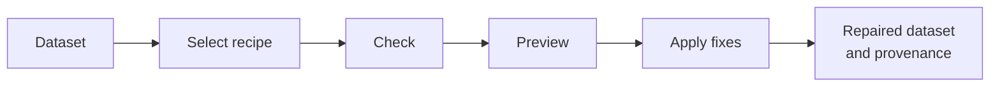
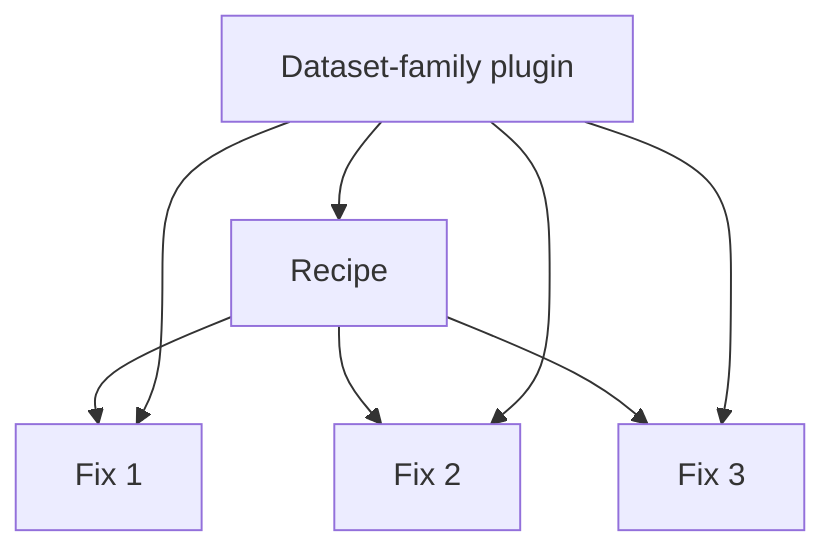
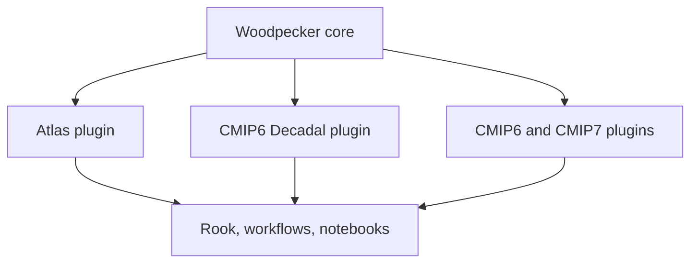

# Woodpecker

## Small, precise fixes for climate data

One shared place for known data repairs

Milano, 2026

---

# Climate data often needs small repairs

- A dataset may be scientifically useful but still contain metadata, coordinate, calendar, encoding, or format issues.
- Processing services need these issues corrected before subsetting, concatenation, regridding, or analysis.
- Teams often implement the same repair independently in services, scripts, and notebooks.
- Those implementations drift and become difficult to review, test, and reuse.

**The result:** fragmented knowledge and repeated maintenance.

---

# A shared package for known fixes

Woodpecker provides a small Python API and command-line interface to:

- check a dataset for known issues
- preview proposed changes with a dry run
- apply selected fixes in a defined order
- record what changed as provenance

Woodpecker keeps the repair logic separate from the processing service that uses it.

> Small, precise fixes for climate data.

---

# The Woodpecker workflow



- Selection can use an explicit recipe ID, dataset metadata, or input paths.
- Preview shows the planned changes without modifying the data.
- Apply performs the repair and can write W3C PROV-JSON.

---

# Fixes, recipes, and plugins



**Fix**  
One small, deterministic check or repair with a stable identifier.

**Recipe**  
An ordered workflow of fixes, options, matching rules, and supporting links.

**Plugin**  
The fixes and recipes owned by a dataset community or project.

---

# A fix has a small author contract

```python
class TimeMetadata(FixFunction):
    prefix = "cmip6_decadal"
    suffix = "time_metadata"

    def matches(self, dataset): ...
    def check(self, dataset) -> list[str]: ...
    def apply(self, dataset, dry_run=True) -> bool: ...
```

- `matches()` identifies relevant datasets quickly.
- `check()` reports the problem.
- `apply()` performs one defined repair.
- The stable ID is `cmip6_decadal.time_metadata`.
- A synthetic dataset test documents the expected behaviour.

The framework stays small. Dataset knowledge remains visible in the fix.

---

# Recipes turn individual fixes into workflows

```yaml
recipes:
  - id: c3s.cmip6_decadal
    match:
      attrs:
        project_id: CMIP6
    steps:
      - id: cmip6_decadal.calendar_normalization
        phase: prepare
      - id: cmip6_decadal.time_metadata
        phase: apply
      - id: cmip6_decadal.publish_metadata
        phase: finalize
```

Recipe phases describe when a repair runs:

- `prepare`: before concatenation or aggregation
- `apply`: normal adaptation steps
- `finalize`: post-processing and publication metadata

Recipes can live in JSON or YAML and can use catalogue, JSON, DuckDB, or automatic discovery backends.

---

# Dataset knowledge stays with its community



- The core supplies registration, selection, recipes, execution, I/O, and provenance.
- Plugins contain dataset-family knowledge.
- Rook applies Woodpecker recipes before generic climate-data operations.
- The same fixes can also run from the CLI, Python, notebooks, or other services.

**Woodpecker prepares the data. Rook operates on it.**

---

# The current plugin landscape

| Dataset family | Namespace | Fixes | Recipes |
| --- | --- | ---: | ---: |
| Atlas | `atlas` | 2 | 1 |
| CMIP6 | `cmip6` | 1 | 0 |
| CMIP6 Decadal | `cmip6_decadal` | 15 | 1 |
| CMIP7 | `cmip7` | 3 | 2 |
| xMIP demonstration | `xmip` | 13 | 2 |

These plugins show the intended division of responsibility. Woodpecker supplies the common mechanism; climate-data specialists supply and review the dataset knowledge.

The catalogue can grow without adding project-specific behaviour to every consuming service.

---

# One contribution can replace several workarounds


A typical contribution:

1. Describe one known dataset issue.
2. Add or update one fix function.
3. Add a small synthetic test.
4. Reference the fix from the appropriate recipe.
5. Submit the change for review by the relevant community.

The review happens once, close to the people who understand the data.

---

# A common fixes package needs a community

> It would be really great if we could all work together on the fixes package to avoid developing fragmented fixes solutions again.

Woodpecker offers a concrete place for that collaboration:

- stable identifiers for fixes and recipes
- explicit ownership through dataset-family plugins
- reviewable Python implementations
- tests that preserve shared knowledge
- reusable execution from services and local tools
- provenance for applied repairs

The main requirement is participation from the climate-data communities that know the issues.

---

# Discussion in Milano

## Questions for the community

- Which existing fixes should move into shared plugins?
- Who can review fixes for each dataset family?
- Which projects already maintain overlapping repair logic?
- What information should accompany a fix or recipe?
- Which additional dataset families need plugins?

## First practical step

Choose one known issue with duplicated implementations and contribute one tested Woodpecker fix.

---

# Woodpecker

## Shared fixes, maintained with the data communities

- Repository: <https://github.com/roocs/woodpecker>
- Documentation: <https://roocs.github.io/woodpecker/>
- Package: `pip install roocs-woodpecker`

**Small, precise fixes for climate data.**

