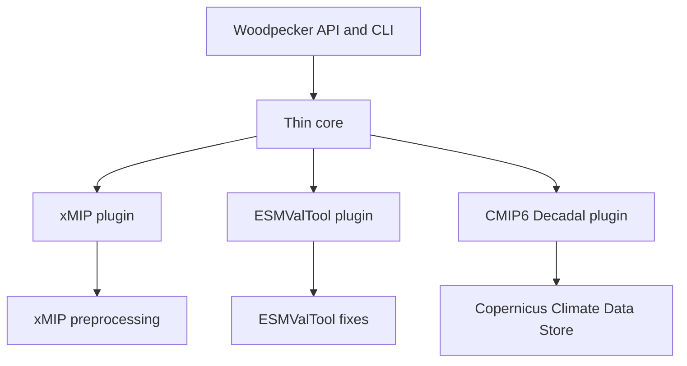
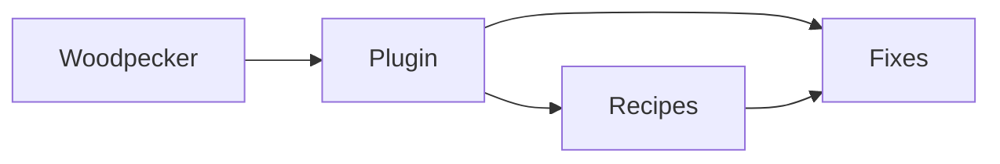
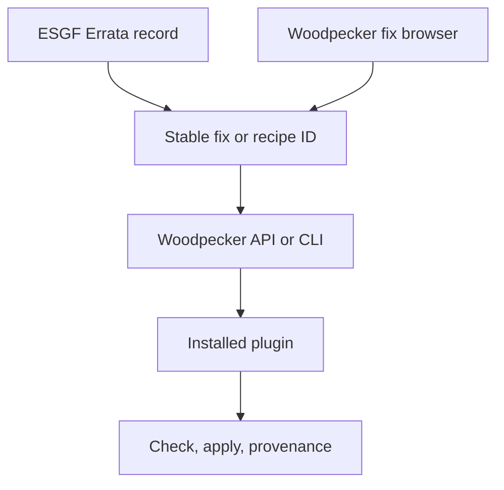
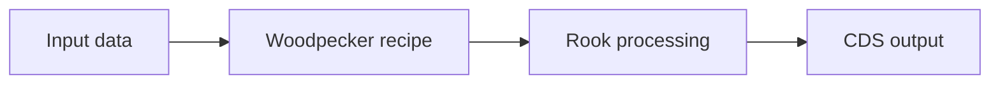

# 1. Woodpecker

## A common interface for climate-data fixes

Woodpecker is a lightweight Python interface for discovering, combining, and applying climate-data fixes supplied by its core and plugins.

<https://github.com/roocs/woodpecker>

Milano, 2026

---

# 2. Why the name Woodpecker?

A woodpecker lives in the forest and picks insects out of trees. It helps to keep the forest healthy.

| Forest image | Climate-data ecosystem |
| --- | --- |
| Forest | Projects, services, and data communities |
| Trees | Climate datasets |
| Bugs | Known data issues |
| Woodpecker | Small, precise fixes |

The name describes the intended role: work within the existing ecosystem and repair specific problems.

---

# 3. Climate-data fixes already exist

Many projects have developed useful repair and standardization code:

- [xMIP](https://github.com/jbusecke/xMIP) cleans and organizes MIP data for analysis in the Pangeo ecosystem.
- [ESMValTool's fixer prototype](https://github.com/ESMValGroup/fixer-prototype) explores configurable fixes with CMIP7 and ESA-CCI plugins.
- Services and projects maintain further fixes in local libraries, scripts, and workflows.

These implementations reflect different data, communities, and use cases. That specialization is useful.

The problem is the lack of a small common contract for finding, referencing, and running them.

---

# 4. Woodpecker does not replace the fix ecosystem

Woodpecker does not aim to become the single fixing library for every climate-data project.

It provides:

- a thin interface layer
- a small set of common functions
- plugin discovery
- stable identifiers for fixes and recipes
- a Python API and command-line interface
- checking, dry-run previews, execution, and provenance

The plugins contain most of the domain-specific work.

---

# 5. Thin core, independent plugins



Plugins may be narrow and project-specific. They may implement fixes directly or adapt existing libraries.

Woodpecker gives each plugin the same entry point without taking ownership away from its maintainers.

---

# 6. A small common vocabulary

**Fix**  
One check or repair exposed through a stable identifier.

**Recipe**  
An ordered set of fixes, options, matching rules, and supporting links.

**Plugin**  
A separately owned package that provides fixes and recipes for a project, dataset family, or use case.



---

# 7. The plugin owns the climate-data knowledge

```python
class BroadcastLonLat(FixFunction):
    prefix = "xmip"
    suffix = "broadcast_lon_lat"

    def apply(self, dataset, dry_run=True):
        ...
```

The plugin provides:

- the scientific and technical knowledge
- the implementation
- optional matching and checks
- tests and maintenance

Woodpecker provides registration, discovery, execution, results, and provenance.

---

# 8. Stable identifiers form the common contract

```text
xmip.broadcast_lon_lat
woodpecker.normalize_longitude_convention

xmip.cmip6_preprocessing       # recipe
```

The identifier is independent of the calling environment.

The same fix or recipe can be referenced by:

- a Python workflow
- a processing service such as Rook
- a command-line call
- an ESGF Errata record or another portal
- documentation and tests

The portal does not need to reproduce the repair instructions. It can point to a maintained, executable definition.

- ESGF Errata: <https://errata.esgf.io/static/index.html>
- Woodpecker fix IDs: <https://roocs.github.io/woodpecker/fixes.html>

---

# 9. The fix browser makes identifiers visible

The Woodpecker documentation includes an interactive overview of all registered fixes:

- search by ID, name, category, dataset, or source
- distinguish core fixes from plugin-provided fixes
- inspect descriptions, severity, labels, aliases, and package sources
- link directly to a fix through its stable anchor

Example: [`woodpecker.normalize_tas_units_to_kelvin`](https://roocs.github.io/woodpecker/fixes.html#woodpecker.normalize_tas_units_to_kelvin)

This browser is a demonstration of how a portal, an Errata entry, or documentation can refer to one precise fix.

---

# 10. From an ESGF Errata record to an executable fix



This creates a link between issue documentation and executable repair logic:

1. The Errata record identifies the affected data.
2. It references a stable fix or recipe ID.
3. The Woodpecker documentation makes the ID and its source discoverable.
4. Woodpecker resolves that ID through an installed plugin.
5. A user or service can check, preview, and apply the repair.

The plugin remains the authoritative implementation.

---

# 11. One interface for local and service use

## Python library

```python
import woodpecker

recipe = woodpecker.recipe.get("xmip.cmip6_preprocessing")
result = woodpecker.recipe.apply(dataset, recipe, dry_run=False)
```

## Command line

```bash
woodpecker apply ./data --recipe-id xmip.cmip6_preprocessing
```

Both routes use the same identifiers, plugins, and recipes.

Matching, separate checks, and dry-run previews are also available when needed.

---

# 12. Rook uses Woodpecker as a library



- Woodpecker prepares known dataset issues through the Python API.
- Rook continues with generic operations such as subset, concatenate, or regrid.
- Dataset-specific behaviour stays outside the generic processing code.
- The same recipe remains available outside Rook through the CLI or another Python workflow.

**Woodpecker prepares the data. Rook operates on it.**

---

# 13. Recipes describe a use case without centralizing its fixes

```yaml
recipes:
  - id: xmip.cmip6_preprocessing
    steps:
      - id: woodpecker.rename_variables
      - id: xmip.broadcast_lon_lat
      - id: woodpecker.normalize_longitude_convention
```

- A recipe combines fixes for a defined workflow.
- The fixes can come from one or several plugins.
- Plugins retain their own namespaces and release cycles.
- JSON and YAML make recipes portable and reviewable.
- Catalogue, JSON, and DuckDB stores support different deployment needs.

---

# 14. Current plugins demonstrate the pattern

| Plugin or example | Focus |
| --- | --- |
| Atlas | Production adaptations for the Copernicus Climate Data Store |
| CMIP6 Decadal | Production Decadal adaptations for the Copernicus Climate Data Store |
| CMIP6 | Dummy plugin used as a placeholder |
| ESMValTool CMIP7 example | CMIP7 and ESA-CCI examples based on the ESMValTool fixer prototype |
| xMIP | xMIP-style CMIP6 preprocessing exposed as Woodpecker fixes and recipes |

These plugins do not define the limit of Woodpecker.

Other projects can provide independent plugins while keeping their own code, scope, governance, and users.

---

# 15. Collaboration without one central fixes library

> It would be really great if we could all work together on the fixes package to avoid developing fragmented fixes solutions again.

A common Woodpecker interface allows cooperation without forcing every project into one implementation:

- projects continue to own their fix logic
- plugins expose that logic through a shared pattern
- stable identifiers make fixes discoverable and referenceable
- recipes combine fixes for specific workflows
- services and users call them through the same interface

The shared work is the contract and the connections between projects.

---

# 16. Questions for Milano

- Can existing fix libraries expose selected functions as Woodpecker plugins?
- Which identifiers should ESGF Errata and other portals reference?
- Who owns and reviews each project or dataset namespace?
- What metadata should accompany every published fix and recipe?
- Which common functions belong in the thin core?

## A practical first step

Expose one existing project fix through a plugin and reference its stable ID from a recipe or Errata example.

---

# 17. Woodpecker

## One interface, many fix implementations

- Woodpecker: <https://github.com/roocs/woodpecker>
- Documentation: <https://roocs.github.io/woodpecker/>
- Fix browser: <https://roocs.github.io/woodpecker/fixes.html>
- ESGF Errata: <https://errata.esgf.io/static/index.html>
- xMIP: <https://github.com/jbusecke/xMIP>
- ESMValTool fixer prototype: <https://github.com/ESMValGroup/fixer-prototype>

`pip install roocs-woodpecker`
